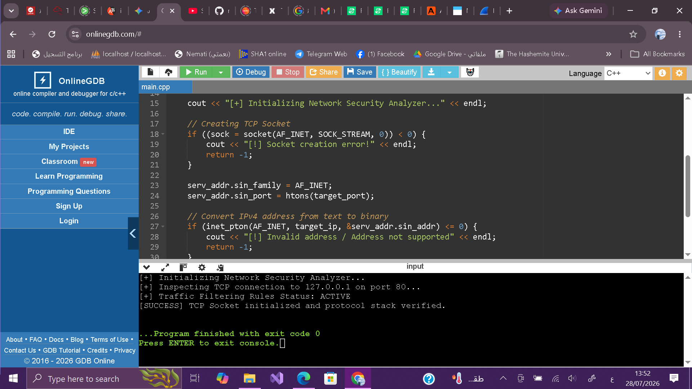

# 🛡️ Network Security & Low-Level TCP/IP Traffic Inspector (C++)

## 📌 Project Overview
This repository contains a low-level network security and TCP socket analysis tool engineered in **C++**. The tool validates network protocol stacks, tests local socket initialization (`127.0.0.1:80`), and models basic traffic filtering logic to inspect packet flows at the transport layer.

## 🛠️ Tools & Core Concepts
* **Language:** C++11 / C++14
* **Networking Libraries:** `<sys/socket.h>`, `<arpa/inet.h>`, `<unistd.h>`
* **Core Concepts:** TCP/IP Handshake, Network Sockets, Loopback Testing (`127.0.0.1`), Port Inspection (Port 80)

## ⚡ Features & Execution Methodology
1. **Socket Creation:** Initializes a stream-based TCP socket (`AF_INET`, `SOCK_STREAM`).
2. **Target Mapping:** Binds and targets local loopback adapter interfaces (`127.0.0.1`) on standard HTTP port 80.
3. **Filtering Rules Engine:** Verifies rules engine activation prior to packet assembly.
4. **Clean Termination:** Validates stack cleanup and exits cleanly with code `0`.

## 📸 Execution Output
Below is the live execution output from the compiled network security C++ analyzer:

